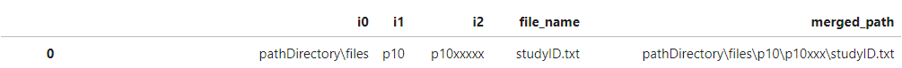
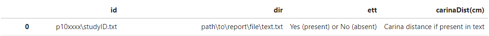

# Leveraging Text Mining to Label Endotracheal Tube Presence in the MIMIC-CXR Database

Offical codebase for "Leveraging Text Mining to Label Endotracheal Tube Presence in the MIMIC-CXR Database" currently in review. 

Previously presentd as an abstract at the American Thoracic Society 2024 meeting in San Diego as "A Natural Language Processing Method to Determine Endotracheal Tube Presence in a Public Image Database".

## Introduction

The [Medical Information Mart for Intensive Care (MIMIC) CXR Database v2.0](https://www.physionet.org/content/mimic-cxr/2.0.0/), is a large publicly available database of CXR images from intensive care unit patients at Beth Israel Deaconess Medical Center. Its comprehensive nature and inclusion of both images and text reports make it valuable for advancing computer vision and NLP techniques in medical research. While the database has been previously annotated, these labels have all focused on pulmonary findings and not lines,tubes,drains etc. 

Utilizing text mining of radiology reports in the MIMIC database, our methodology introduces an additional category for endotracheal tube (ETT) presence/absence to the existing catalogue of labels without the need for direct visualization of any images. 

### Getting Started

To begin, download the radiology reports from the MIMIC-CXR Database, provided in a compressed file: **mimic-cxr-reports.zip**. 

The repository includes two key files:
1. **imports.py**: contains all libraries that are utilized in the main codebase. 
2. **utilities.py** contains all author generated functions that are needed in the main codebase. 

Once the **mimic-cxr-reports.zip** is downloaded, run **openFiles_and_replaceText.py**. 

#### openFiles_and_replaceText.py

This script processes each text file in the entire MIMIC database in two steps, which will likely take several hours depending on your equipment.

##### Step 1: Generating path locations
* The script prompts you to specify the location of **mimic-cxr-reports.zip**.
* It then unzips and extracts all files and folders into a new folder named *Zip Extraction* in the current working directory.
* A dataframe is created with the following columns, representing the file structure of the MIMIC database, with a full working path directory of each text file in the "merged_path" column.

* This dataframe is then saved as *paths.csv* to a new folder "CSV Files"

##### Step 2: Search for ETT tokens 
* Using **paths.csv**, the code searches each text file for five different spellings of endotracheal tube:
    1. Endotracheal tube
    2. Endotracheal-tube
    3. Et tube
    4. Et-tube
    5. Ett  
    
    
* A dataframe is created to store each study that contains one of the tokens above, replacing the token with "##ett##" for later identification.

* This dataframe is saved as **reportText_replacedWords.csv** in the *CSV Files* folder.

#### mainTM.py

This file contains the main text mining algorithm. 

* Using **reportText_replacedWords.csv** generated in **openFiles_and_replaceText.py**, a dataframe is generated with the following columns as below:

* The "ett" column represents the final prediction for each radiology report in the MIMIC Database.

#### dicomProcessing.py

Although not part of the text mining methodology, this file provides code to filter down each radiology study to a single image, as described in our published manuscript.

* The code scans DICOM headers to exclude non-anteroposterior/posteroanterior views and inverted images. When multiple images are linked to a single CXR report, the one with the lowest series number is chosen.
* Note: Several DICOM headers could not be opened by the pydicom library and are saved in a separate CSV called  *errors.csv*. 
